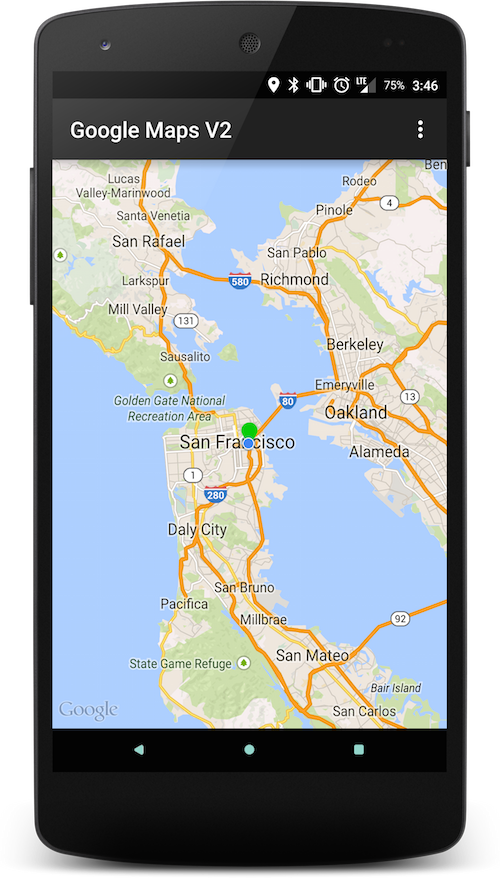
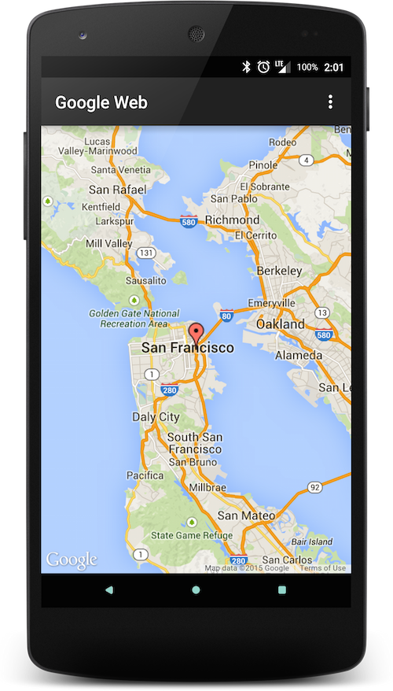

# AirMapView

[](https://travis-ci.org/airbnb/AirMapView)

AirMapView is a view abstraction that enables interactive maps
for devices with and without Google Play Services. It is built
to support multiple native map providers including Google Maps V2 and soon Amazon Maps V2.
If a device does not have any supported native map provider, AirMapView
will fallback to a web based map provider (currently Google Maps). Easy to integrate, it is a drop-in replacement for the Google Maps V2 package. AirMapView's original author is [Nick Adams](https://github.com/nwadams).

* [Features](#features)
* [Download](#download)
* [How to Use](#how-to-use)
* [Sample App](#sample-app)

## Features

* Google Maps V2
* Swap map providers at runtime
* Web based maps for devices without Google Play Services





## Download

Grab via Gradle:

```groovy
compile 'com.airbnb.android:airmapview:1.3.0'
```

Snapshots of the development version are available in [Sonatype's `snapshots` repository](https://oss.sonatype.org/content/repositories/snapshots/).

## Sample App
The project includes a sample app which uses AirMapView. The sample app allows toggling between map providers, exemplifies adding map markers, and displays various callback information. The sample project can be built manually or you can [download the APK](https://www.dropbox.com/s/8gcxn2ouc44t53x/AirMapView-Sample.apk?dl=0).

## How to Use

1. Define `AirMapView` in your layout file
    ```xml
    <com.airbnb.android.airmapview.AirMapView
        android:id="@+id/map_view"
        android:layout_width="match_parent"
        android:layout_height="match_parent"/>
    ```

1. Initialize in code
    ```java
    mapView = (AirMapView) findViewById(R.id.map_view);
    mapView.initialize(getSupportFragmentManager());
    ```

1. Add markers/polylines/polygons
    ```java
    map.addMarker(new AirMapMarker(latLng, markerId)
            .setTitle("Airbnb HQ")
            .setIconId(R.drawable.icon_location_pin));
    ```

## Mapbox Web setup
To use Mapbox Web maps in AirMapView, you'll need to [sign up for a free account with Mapbox](https://www.mapbox.com/signup/).  From there you'll use an [Access Token](https://www.mapbox.com/help/define-access-token/) and [Map ID](https://www.mapbox.com/help/define-map-id/) in your AirMapView app.  They're are then included in your app's `AndroidManifest.xml` file as `meta-data` fields.

```xml
<meta-data
    android:name="com.mapbox.ACCESS_TOKEN"
    android:value=ACCESS_TOKEN/>
<meta-data
    android:name="com.mapbox.MAP_ID"
    android:value=MAP_ID/>
```

## Native Google Maps setup

With AirMapView, to support native Google maps using the [Google Maps v2](https://developers.google.com/maps/documentation/android/) SDK you will still need to set up the Google Maps SDK as described [here](https://developers.google.com/maps/documentation/android/start#getting_the_google_maps_android_api_v2). Follow all the instructions except the one about adding a map since AirMapView takes care of that for you. See the sample app for more information about how to set up the maps SDK.

License
--------

    Copyright 2015 Airbnb, Inc.

    Licensed under the Apache License, Version 2.0 (the "License");
    you may not use this file except in compliance with the License.
    You may obtain a copy of the License at

       http://www.apache.org/licenses/LICENSE-2.0

    Unless required by applicable law or agreed to in writing, software
    distributed under the License is distributed on an "AS IS" BASIS,
    WITHOUT WARRANTIES OR CONDITIONS OF ANY KIND, either express or implied.
    See the License for the specific language governing permissions and
    limitations under the License.


 [1]: http://airbnb.github.io/airbnb/AirMapView/
